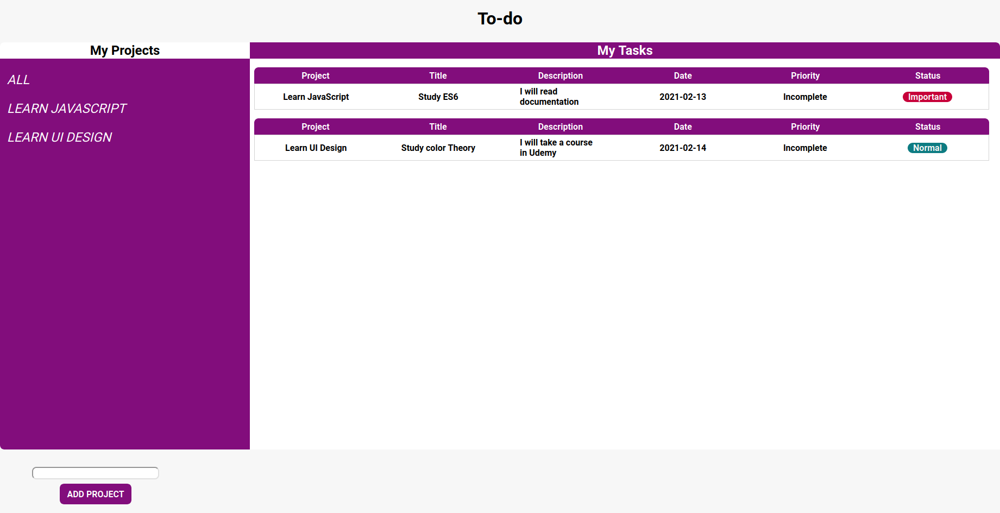

# To-do

The todo-list project was built as the third project of the JavaScript module from Microvers. Here you can set projects and add tasks to each project.

##  :hammer: Built with:

- Html
- Scss
- JavaScript
- Webpack

##  :red_circle: Live Demo:

[Live demo](https://ricardomonte.github.io/To-do/)

##  :construction_worker: Getting Started

To get a local copy up and running follow these simple steps:

- Go to the main page.
- Press the "Code" button and get the repo link.
- Clone it using git command "git clone".
- Open in terminal the folder just cloned.
- run in terminal 'npm install'.
- To see locally run 'npm run build'.
- You can visualize the project by opening index.html in the dist folder.

##  :construction_worker: For testing

After runing 'npm install':

- In the terminal run 'npm run test'.

## :bust_in_silhouette: Author

- Github: [@ricardomonte](https://github.com/ricardomonte)
- Twitter: [@ramnkco](https://twitter.com/ramnkco)
- LinkedIn: [Ricardo Montenegro](https://www.linkedin.com/in/ricantomontenegro/)

## :raised_hand: :raised_hand: Contributions

Contributions, issues and feature requests are welcome!

Feel free to check the [issues here](https://github.com/ricardomonte/Capstone-Project/issues).

## Show your support

Give a :star: if you like this project!.

##  :grey_exclamation: Acknowlegment

- To [Microverse](https://www.microverse.org/)
- Mentor.
- Stand up team

##  :memo: License

This project is [MIT](LICENSE) licensed.